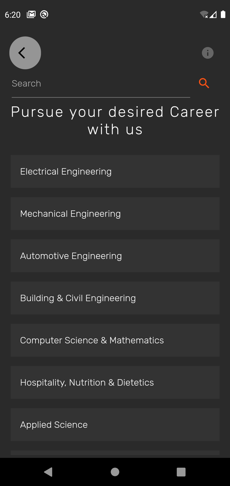
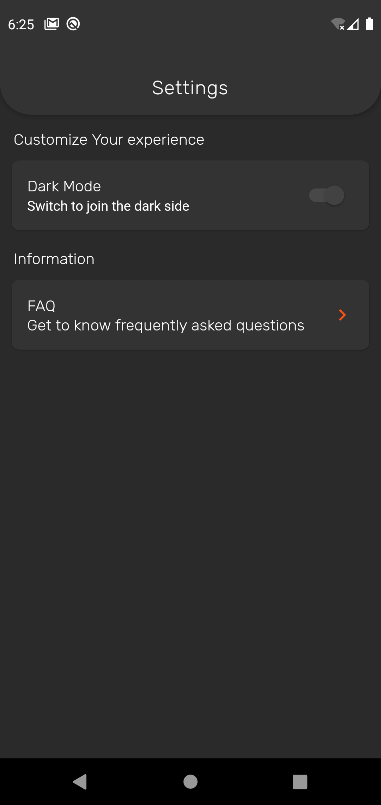
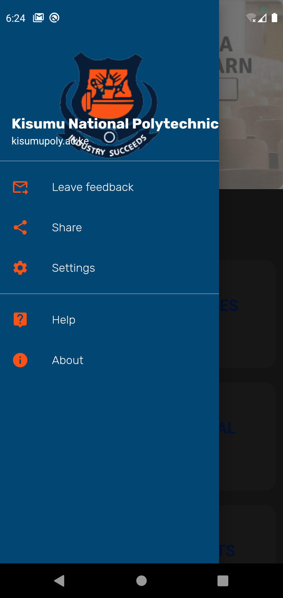
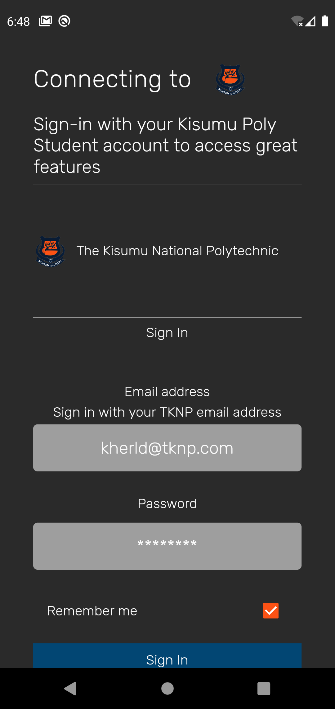
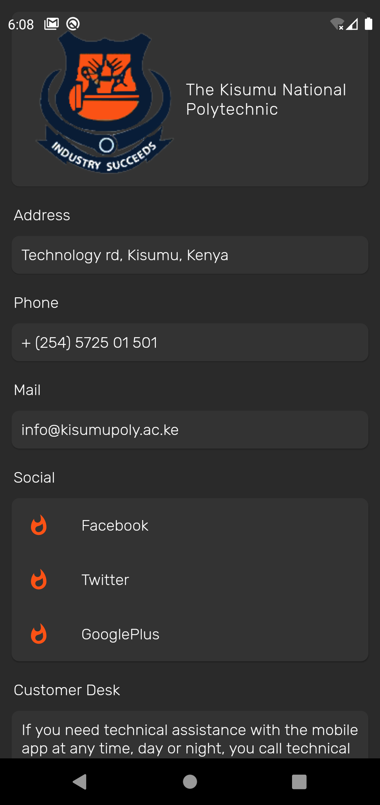
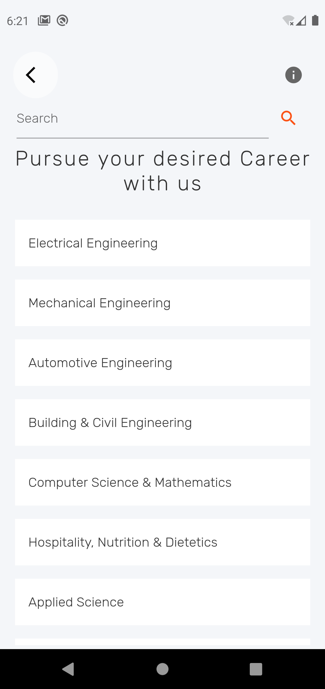
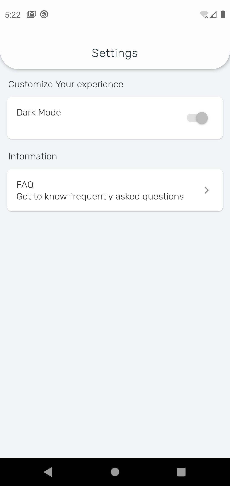
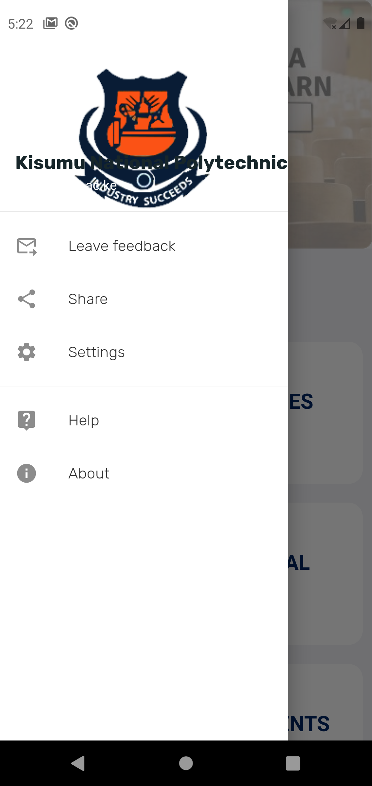
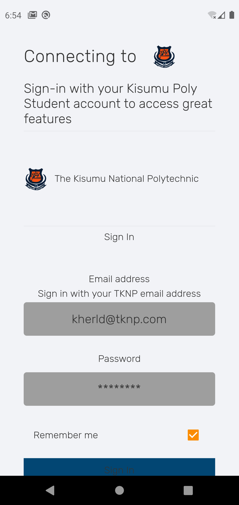
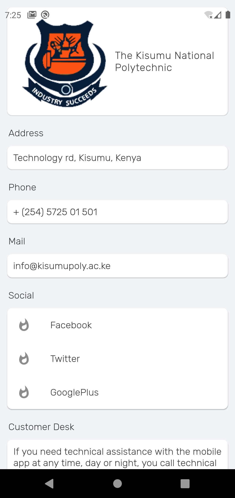

<!--
*** Thanks for checking out this README Template. If you have a suggestion that would
*** make this better, please fork the repo and create a pull request or simply open
*** an issue with the tag "enhancement".
*** Thanks again! Now go create something AMAZING! :D
-->

# Unofficial TKNP App

A supplement to the Academic Profile website. It was designed to run smoothly & easily to facilitate
e-learning, which has become an essential system in education. This app comes with the most services that
the student needs during his study period, Looking forward on adding new services that is in the interest of the student in particular.

## Screenshots

The Data shown is not correct and just there for demonstration purposes.

### Dark mode

### Light mode

#### Please see the changelog file for recent improvements and the issue tracker for short-term plans.

### Supported Platforms
- iOS
- Android
- `Mac OS`
- `Windows`
- `Linux`

### Built With
Google Flutter SDK
* [Flutter](https://flutter.dev)

<!-- GETTING STARTED -->
## Getting Started
* keep calm and [git⚠️Started](CONTRIBUTING.md)
* This is not an official [tknp](https://kisumupoly.ac.ke) product.

### Prerequisites

* [Flutter SDK](https://flutter.dev)
* [Android SDK & Android Studio](https://developer.android.com/studio) for deployment to Android
* [XCode IDE](https://developer.apple.com/xcode/) for deployment to iOS/iPad/MacOS
* [VS Code IDE](https://code.visualstudio.com/) optional

## Installation
Since this is an unofficial App it unfortunately cannot be released in the App Store or Google Play. 
To use this Application on Android phones you can download the latest prebuilt apk.
* [Download It Here](https://github.com/kherld-hussein/tknp/releases/download/v0.1-alpha/app-release.apk)

## Currently implemented features:
* TKNP login
* Lectures
* News
* Portal access
* Notification (mass)

## RoadMap & ToDo:
| Chatting Platform for each department
* Each student to able to chat from withing the specified departments and share ideas with other students.

| Lecturer's Platform
* Lecturers to interact with there student.
* Share contents and learning resources.

| TimeTable
* Display customizable student calendar integration.

| Clearance `@deprecated`
* Final clearance of the students through the application.

| Improve docs**
* Add Wiki documentation

<!-- CONTACT -->
## Contact
Kherld Hussein - [@kherld-hussein](https://twitter.com/kherld-hussein) - kherld11@gmail.com

## License

[GPL-3.0 License](LICENSE.md)
# tknp
